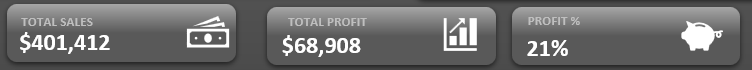
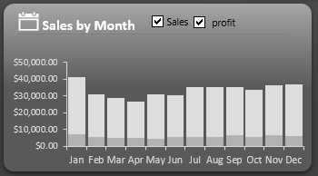
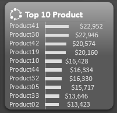
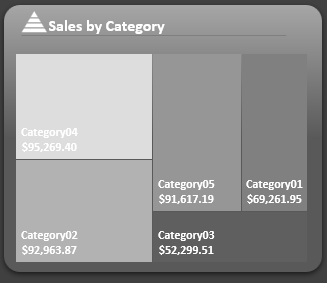
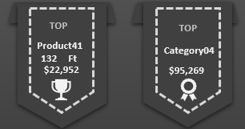
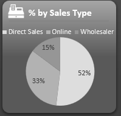
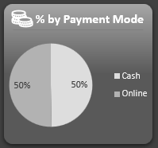
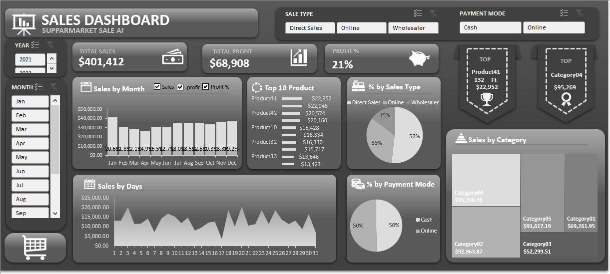

# Supermarket Sales Analysis

## Content
[Project overview](#project-overview)

[Data source](#data-source)

[Tool](#tool)

[Data Preperation](#data-preperation)

[Exploratory Data Analysis](#exploratory-data-analysis)

[Data analysis](#data-analysis)

[Results](#results)

[Dashboard preview](#dashboard-preview)

[Recommendation](#recommendation)

### Project overview

This data analysis project aims to provide insights into the sales performance of a supermarket shop over 2021 to 2022. By analyzing various aspects of the financial data, we seek to identify trends, make data driven recommendations and gain a deeper understanding of the supermarket sales performance.

### Data source

Financial data: The primary dataset used for this analysis is the "Supermarket-sales-dataset-file.xlsx" file containing to sheet of data which are "Input Data" and "Master Data" containing information about each sales made.

[Donwload dataset](https://github.com/Tarzus-analyst/Data-analysis-projects/blob/main/Supermarket-sales-dataset-file.xlsx)

### Tool

- EXCEL

### Data preperation

- Data loading and inspection
- Data cleaning and transformation
- Handling missing value

### Exploratory Data Analysis

EDA involue exploring the sales data to answer key questions such as:
  - What is the overall sales trands?
  - Which product are the top 10 sellers?
  - Which product and catigory are the top?
  - What are the peak sales periods?

### Data analysis

The following opperation was carried out during this analysis
- Pivot table
- Excel formulas
    - VLOOKUP
    - IFRROR
    - RANK
    - SUM
    - OFFSET

### Results

**KPIs**

The KPIs analysis was derived a pivot table, the following are the overall result made during the two(2) of Sales
  - The supermarket made $401,412 total sales during this period
  - The supermarket made $68,908 of profit during this period
  - And 21% of profit margin
---

---

**Sales by Trends**

The following trends give a detail insight of sales at peak of month
  - the highest sales was made on January with $41,346.96 of total sales
  - Followed by December and November with $37,097.98 and $36,124.07 of Sales made during this months
---

---

**Top 10 Product by Sales**

These give a list of the top 10 performing Product of the supermarket. The following Visual is table with the list and a bar chart for comparing 

 
 | 
|------------------------------|------------------------------------|

**Sales by category**

The Top three category by sales are
  - Category04 with $95,269.40 of total Sales
  - Category02 with $92.963.87 of total Sales
  - Category05 with $91,617.19 of total Sales
---

---

**Product and Category**

The following are the Product and Category with the highest amount of Sales
  - Product41 with $22,952
  - Category04 with $95,269.40 of total Sales

---

---

**Percentage by Sales Type**

  - Direct Sales with 55% of Sales
  - Online with 33% of sales 
  - Wholesaler with 15% of sales
    
---

---

**Percentage by Payment Mode**
  - Online with 50% of Sales
  - Cash with 50% of Sales
---

---
### Dashboard preview

 

### Recommendation

Based on th analysis, we recomend the following action:
- invest in marketing and promotion during peak sales season to maximize profit.
- Focus on expending and promoting products which are top sales.

    
 

  

  
